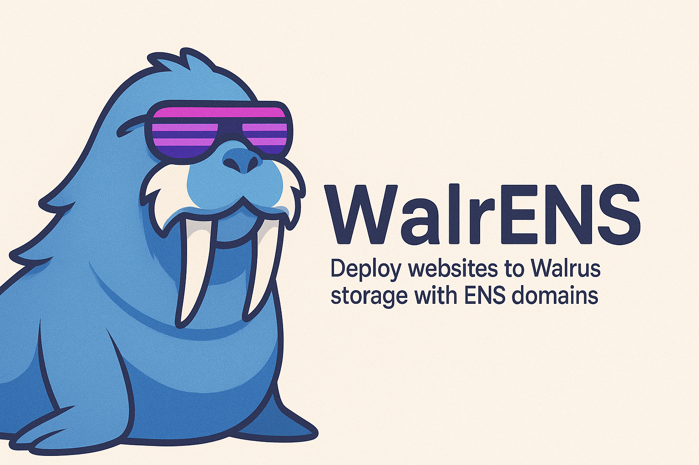

# WalrENS 🌐

**Transform your ENS name into a decentralized website**

WalrENS is a complete platform for creating, deploying, and managing decentralized websites using ENS names and Walrus Sites. Deploy React apps, static sites, blogs, and more with permanent, censorship-resistant hosting.

##  Features

- ** Template-Based Design**: Professional templates for personal, portfolio, blog, and business sites
- ** ENS Integration**: Your ENS name becomes your website URL (yourname.eth)
- ** Walrus Storage**: Decentralized, censorship-resistant hosting on Walrus network
- ** One-Click Deploy**: Deploy complete websites with assets, routing, and SEO optimization
- ** Multi-Device Preview**: Test your site across desktop, tablet, and mobile
- ** Gateway Serving**: Fast content delivery with SPA routing support
- ** CLI Tools**: Command-line deployment and management tools

##  Quick Start

### Prerequisites

- Node.js 20+
- pnpm package manager
- ENS name (for deployment)
- Sui wallet (for Walrus Sites)

### Installation

```bash
# Clone the repository
git clone https://github.com/your-org/walrens
cd walrens

# Install dependencies
pnpm install

# Build all packages
pnpm build
```

### Development

```bash
# Start the site builder (React app)
pnpm dev:site-builder

# Start the gateway (Cloudflare Worker)
pnpm dev:gateway

# Use the CLI
pnpm dev:cli
```

##  Project Structure

```
walrens/
├── apps/
│   ├── gateway/          # Cloudflare Worker for serving sites
│   └── site-builder/     # React app for website creation
├── packages/
│   ├── cli/             # Command-line deployment tools
│   └── sdk/             # Core SDK for Walrus Sites integration
└── docs/                # Documentation and guides
```

##  Getting Started

### 1. Using the Web Interface

1. Visit the site builder at `http://localhost:3001`
2. Choose a template for your website
3. Upload your files or customize the template
4. Preview your site across different devices
5. Enter your ENS name and deploy to Walrus Sites

### 2. Using the CLI

```bash
# Deploy a website directory
npx @walrens/cli deploy ./my-website mysite.eth --chain sepolia

# Check site status
npx @walrens/cli status mysite.eth

# Update an existing site
npx @walrens/cli update ./updated-website mysite.eth
```

## 🔧 Environment Setup

Create a `.env` file with the following variables:

```bash
# Required for deployment
SUI_PRIVATE_KEY=0x...
ETH_PRIVATE_KEY=0x...

# Optional - will use defaults if not provided
WALRUS_PUBLISHER_URL=https://publisher.walrus-testnet.walrus.space
WALRUS_AGGREGATOR_URL=https://aggregator.walrus-testnet.walrus.space
SUI_RPC_URL=https://fullnode.testnet.sui.io:443
ETH_RPC_URL=https://eth-sepolia.g.alchemy.com/v2/YOUR_KEY
```

##  API Reference

### SDK Usage

```typescript
import { 
  deployWebsiteToWalrus,
  setEnsWalrusSite,
  resolveWalrusSite
} from '@walrens/sdk'

// Deploy a website
const files = [
  { path: 'index.html', content: htmlContent },
  { path: 'style.css', content: cssContent }
]

const result = await deployWebsiteToWalrus(
  'mysite.eth',
  files,
  suiPrivateKey,
  {
    suiRpcUrl: 'https://fullnode.testnet.sui.io:443',
    walrusPublisherUrl: 'https://publisher.walrus-testnet.walrus.space'
  }
)

// Link to ENS
await setEnsWalrusSite('mysite.eth', result.objectId, {
  privateKey: ethPrivateKey,
  rpcUrl: ethRpcUrl
})
```

### CLI Commands

```bash
# Deploy a website
walrens deploy <directory> <ensName> [options]

# Update an existing site  
walrens update <directory> <ensName> [options]

# Check site status
walrens status <ensName> [options]

# Link existing blob to ENS (legacy)
walrens link <ensName> <pathOrFile> [options]
```

##  ENS Text Record Format

WalrENS supports both legacy and enhanced ENS text record formats:

### Legacy Format (walrus text record)
```json
{
  "type": "site",
  "id": "0x...",
  "index": "index.html"
}
```

### Enhanced Format (walrus-site text record)
```json
{
  "type": "site", 
  "objectId": "0x...",
  "network": "sui-testnet",
  "index": "index.html"
}
```

## 🏗 Architecture

WalrENS consists of several integrated components:

1. **Site Builder**: React-based web interface for creating websites
2. **SDK**: Core library for Walrus Sites and ENS integration
3. **CLI**: Command-line tools for developers and CI/CD
4. **Gateway**: Cloudflare Worker for serving websites with ENS resolution

### Data Flow

1. User creates website using templates or uploads files
2. Files are packaged and uploaded to Walrus storage
3. Walrus Site object is created on Sui blockchain
4. ENS text record is updated to point to the site
5. Gateway resolves ENS names and serves content from Walrus

##  Website Templates

WalrENS includes several professional templates:

- **Personal**: Simple about page with links and contact info
- **Portfolio**: Project showcase with galleries and skills
- **Blog**: Multi-page blog with categories and search
- **Business**: Professional landing page with services

## 🚨 Troubleshooting

### Common Issues

**Gateway not serving content**
- Check ENS text record is set correctly
- Verify Walrus object ID is valid
- Ensure gateway environment variables are configured

**Deployment fails**
- Verify Sui private key has sufficient funds
- Check Walrus services are accessible
- Ensure ENS name is owned by the private key

**Files not uploading**
- Check file size limits (10MB per file)
- Verify file types are supported
- Ensure network connectivity to Walrus

### Getting Help

- Check the [documentation](./docs/) for detailed guides
- Open an issue on GitHub for bugs
- Join our community for support

## 🛣 Roadmap

- [ ] **v1.0**: Basic site deployment and ENS integration
- [ ] **v1.1**: Advanced templates and customization
- [ ] **v1.2**: Custom domain support via ENS
- [ ] **v1.3**: Collaborative editing and version control
- [ ] **v2.0**: Integrated analytics and SEO tools

##  Contributing

We welcome contributions! Please see our [contributing guide](./CONTRIBUTING.md) for details.

##  License

MIT License - see [LICENSE](./LICENSE) for details.

##  Acknowledgments

- **ENS**: For decentralized naming infrastructure
- **Walrus**: For decentralized storage and hosting
- **Ethereum**: For the decentralized web ecosystem

---

**Made with ❤️ by the WalrENS team**
